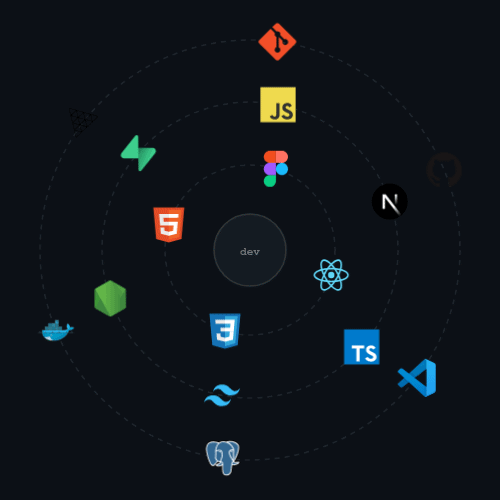

# 👋 I'M KARI!

*UI/UX Designer & Frontend Developer*

Diseño interfaces y construyo lo que diseño — ese cruce entre el diseño y el código donde una cosa no existe sin la otra.

- 🎨 Figma primero, código después
- 🚀 Me obsesionan las interfaces que se **sienten** bien
- 🧠 Explorando 3D interactivo con Three.js y WebGL
- 🇦🇷 Buenos Aires, Argentina
- 💖 En una relación complicada con el CSS de las 3am

---

## 💻 Tech Stack

  

---

## 📊 Estadísticas de GitHub

  
  

  

---

---

## 📬 Contacto

---

  

